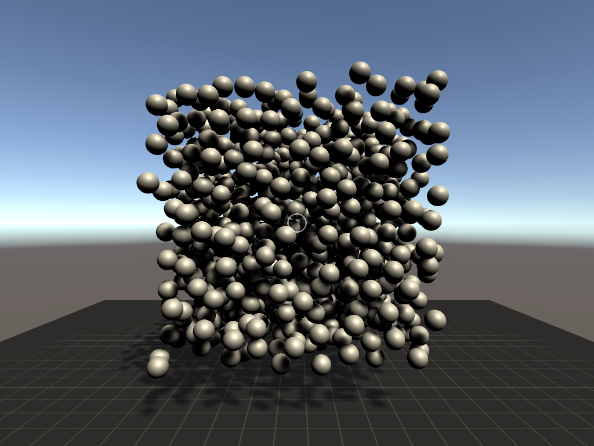

# Overview
This is a collection of projects written in C-Sharp and developed on the game engine Unity.

# Requirements
Latest version of Unity and Microsoft Visual Studio.

# Table of contents

## Cameras
Contain different types of cameras that can be found in video games :
* First-person camera
* Third-person camera

## Graph
Create a 3D graph that can be dragged around with the mouse inside the scene like a chain by using inverse kinematics (only works for open chains for now).

## Random sphere packing
Create spheres inside a bounding box at random without overlaps. The spheres can have their sizes randomized and have a minimum distance separating each of them. Three search methods are used to test whether a newly inserted sphere collides with the existing ones (without using the game engine collision detection) :
* Linear search : Iterate normally through a list of spheres until a collision occurs.
* Random search : Iterate randomly through a list of spheres until a collision occurs.
* Octree search : Iterate through a list of spheres occupying a space (where the new sphere landed) until a collision occurs.

## Others
Contain some accessory classes :
* MouseDragScript : Make a game object in the scene draggable.
* ConstrainedFloat : Wrapper class for floating numbers with lower bound and upper bound.
* ConstrainedVector3 : Wrapper class for Vector3 with lower bound and upper bound.
* SerializableMatrix1D : One-dimensional matrix that can be serialized.
* Utilities : Contain methods that search for objects in the scene.
